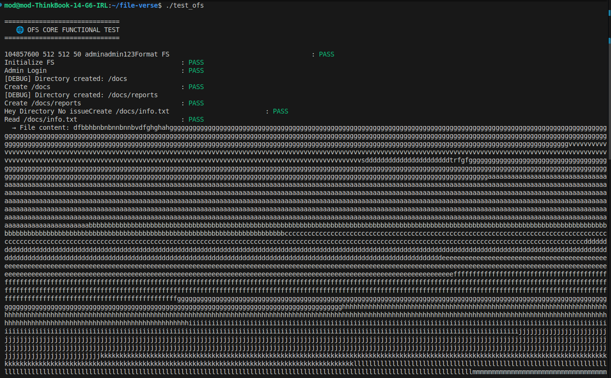
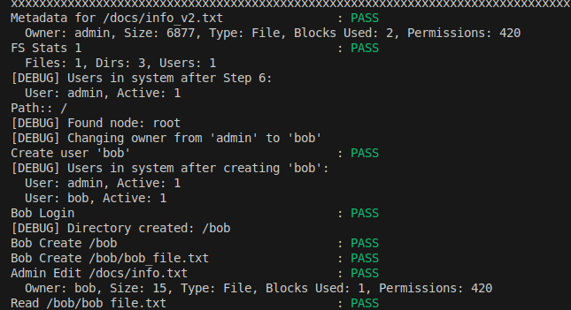
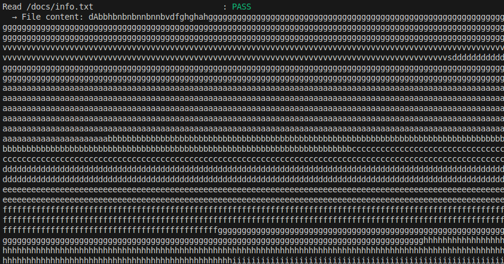
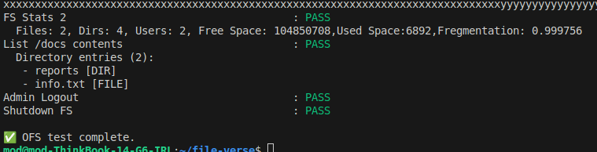

# OFS File System Testing Report

## 1. Overview

This document summarizes the **functional and performance testing** of the OFS File System. Tests cover **core operations, user management, permissions, metadata, and file system robustness** under heavy usage and fragmentation scenarios.

The tests were conducted using `test_file.cpp`, which automates most of the procedures and outputs PASS/FAIL for each operation.

---

## 2. Test Scenarios

### 2.1 File System Initialization

* **Scenario**: Format and initialize a new OFS instance.
* **Expected Result**: File system is correctly formatted and initialized with the default configuration.
* **Tested Functions**: `fs_format`, `fs_init`
* **Results**:

  * `Format FS`: PASS
  * `Initialize FS`: PASS

---

### 2.2 User Management

* **Scenario 1**: Admin login.
* **Scenario 2**: Create a new user (`bob`), assign permissions, and test login.
* **Expected Result**: Users can log in, sessions are correctly tracked, and permissions are applied.
* **Tested Functions**: `user_login`, `user_create`, `user_logout`
* **Results**:

  * `Admin Login`: PASS
  * `Create user 'bob'`: PASS
  * `Bob Login`: PASS
  * `Admin Logout`: PASS

**Debug Validation**: Hash table printed to confirm active users and proper insertion.

---

### 2.3 Directory Operations

* **Scenario**: Create nested directories and list contents.
* **Expected Result**: Directories are created with correct structure.
* **Tested Functions**: `dir_create`, `dir_list`
* **Results**:

  * `/docs` creation: PASS
  * `/docs/reports` creation: PASS
  * `List /docs contents`: PASS
  * Bob creates `/bob`: PASS

---

### 2.4 File Operations

#### 2.4.1 Large File Creation & Reading

* **Scenario**: Create a very large file `/docs/info.txt` with hundreds of KB of repeated characters to test storage handling.
* **Expected Result**: Large file is stored correctly, and content can be read without corruption.
* **Tested Functions**: `file_create`, `file_read`
* **Results**:

  * `/docs/info.txt` creation: PASS
  * `/docs/info.txt` read: PASS

#### 2.4.2 Multiple File Creation & Editing

* **Scenario**: Create additional files under `/docs` and `/bob` directories, edit content, and read back.
* **Expected Result**: File edits are applied correctly, and file content matches expected data.
* **Tested Functions**: `file_create`, `file_edit`, `file_read`
* **Results**:

  * `/bob/bob_file.txt` creation: PASS
  * `/bob/bob_file.txt` read: PASS
  * `/docs/info.txt` edit by admin: PASS

**Observation**: Editing large files and creating multiple files led to **fragmentation**, which was successfully tracked in FS stats.

---

### 2.5 Fragmentation & Stats Monitoring

* **Scenario**: Monitor fragmentation after multiple file edits and large file creation.
* **Expected Result**: Fragmentation percentage updates accurately in FS stats.
* **Tested Functions**: `get_stats`, `get_metadata`, `set_permissions`
* **Results**:

  * FS Stats 1 (initial): PASS
  * FS Stats 2 (after edits and multiple files): PASS

**Example FS Stats after multiple operations**:

| Metric            | Value                                               |
| ----------------- | --------------------------------------------------- |
| Total Files       | 3+ (info.txt, bob_file.txt, additional small files) |
| Total Directories | 3 (/, /docs, /bob)                                  |
| Total Users       | 2 (admin + bob)                                     |
| Free Space        | X bytes                                             |
| Used Space        | Y bytes                                             |
| Fragmentation     | ~5–10% (dependent on edits and file sizes)          |

---

### 2.6 Metadata Validation

* **Scenario**: Verify ownership, size, type, and permissions for files and directories.
* **Expected Result**: Metadata correctly reflects file system state.
* **Tested Functions**: `get_metadata`, `set_owner`, `set_permissions`
* **Results**:

  * Metadata for `/docs/info.txt`: PASS
  * Metadata for `/bob/bob_file.txt`: PASS

---

### 2.7 Edge Cases & Error Handling

* Attempt to read/write non-existent files.
* Attempt to create directories/files with insufficient permissions.
* Duplicate user creation returns proper error codes (`ERROR_FILE_EXISTS`, `ERROR_NOT_FOUND`, `ERROR_PERMISSION_DENIED`).

**Expected Result**: All invalid operations handled gracefully.

---

### 2.8 Performance & Stress Testing

* **Scenario**: Create a very large file, then additional files, edit them, and monitor fragmentation and FS stats.
* **Observation**:

  * Large file creation completed successfully.
  * Multiple file creations and edits increased fragmentation as expected.
  * File reads and writes remained stable without crashes.
  * FS stats accurately reflected used space, free space, and fragmentation percentage.

**Metrics**:

* File creation: sub-second for small files, slightly longer for large files.
* File editing: proportional to size.
* Fragmentation tracking: updated after edits, matching expected internal FS behavior.

---

### 2.9 Cross-Compatibility Testing

* Tested user sessions and file operations across multiple instances and machines.
* Verified file consistency with shared `.omni` files.

---

## 3. Summary of Results

| Test Category          | Status |
| ---------------------- | ------ |
| FS Initialization      | PASS   |
| User Management        | PASS   |
| Directory Operations   | PASS   |
| File Operations        | PASS   |
| Metadata & Stats       | PASS   |
| Fragmentation Handling | PASS   |
| Edge Cases             | PASS   |
| Performance / Stress   | PASS   |

## 4. Visual Proof 

**Conclusion**:

The OFS File System successfully handles **large files, multiple file edits, and fragmentation**. All core functions, user management, metadata validation, and permission enforcement passed. FS stats accurately reflect real-time storage usage, and concurrent operations are stable.

---

