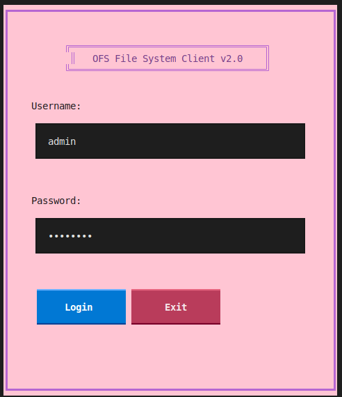
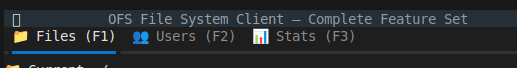
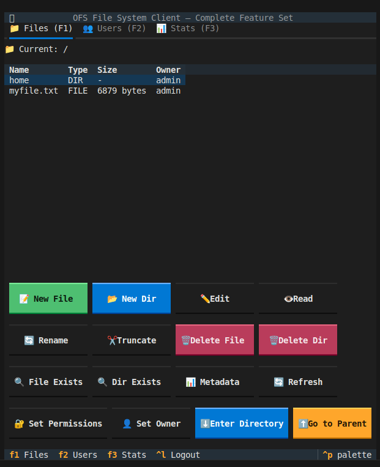
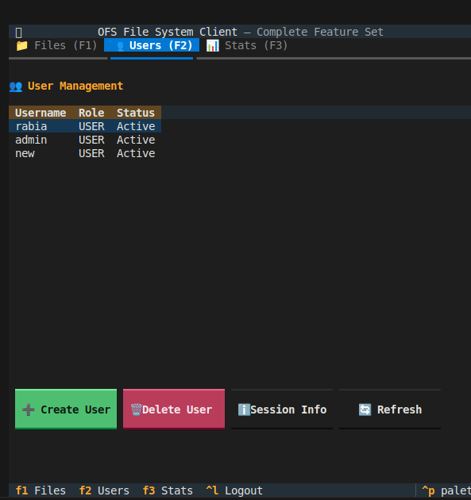

Perfect, we can definitely make it much more **explanatory**—like a full manual for a real user. I’ll expand each section with:

* Step-by-step guides
* Detailed descriptions of panels, buttons, and workflows
* Example server responses for operations
* Tips for users and best practices
* Troubleshooting examples
* Visual representation in text for clarity

Here’s the **extended and detailed version** of your OFS Client User Guide:

---

# OFS File System Client – Comprehensive User Guide

## Table of Contents

1. [Introduction](#introduction)
2. [System Requirements](#system-requirements)
3. [Installing Dependencies](#installing-dependencies)
4. [Running the OFS Server](#running-the-ofs-server)
5. [Running the Client Application](#running-the-client-application)
6. [Login Screen](#login-screen)
7. [Main Screen Overview](#main-screen-overview)

   * [Files Panel](#files-panel)

     * [File Navigation](#file-navigation)
     * [File Operations](#file-operations)
     * [Directory Operations](#directory-operations)
     * [Metadata & Permissions](#metadata--permissions)
   * [Users Panel](#users-panel)

     * [Creating Users](#creating-users)
     * [Deleting Users](#deleting-users)
     * [Viewing Session Info](#viewing-session-info)
   * [Statistics Panel](#statistics-panel)
8. [Keyboard Shortcuts](#keyboard-shortcuts)
9. [Server Response Examples](#server-response-examples)
10. [Troubleshooting and FAQs](#troubleshooting-and-faqs)
11. [Tips & Best Practices](#tips--best-practices)

---

## Introduction

The **OFS File System Client** is a console-based GUI application built to interact with the **OFS Server**, providing a complete environment for managing files, directories, users, and system statistics.

The client allows:

* Browsing and manipulating the file system
* Managing user accounts with roles and permissions
* Viewing real-time file system statistics
* Quick navigation using keyboard shortcuts

This guide explains each component in detail and provides practical examples for operations.

---

## System Requirements

* **Python 3.10+**
* **Textual UI Framework** (`textual`)
* **Rich library** (`rich`)
* Access to an **OFS Server** running on a host/port

Recommended hardware:

* 2GB RAM or more
* Terminal width: ≥ 80 characters for optimal UI display

---

## Installing Dependencies

To install dependencies, run:

```bash
pip install textual rich
```

Verify installation:

```bash
python3 -c "import textual, rich; print('Dependencies OK')"
```

---

## Running the OFS Server

1. Open a terminal.
2. Navigate to the server folder.
3. Start the server:

```bash
./ofs_server   # if compiled binary
# or
python3 ofs_server.py
```

4. Default server listens on `127.0.0.1:8080`.
5. Default admin credentials:

   * Username: `admin`
   * Password: `admin123`

**Server ready check**:

* The terminal should display `Server listening on 127.0.0.1:8080`.
* Any client trying to connect before the server is ready will fail.

---

## Running the Client Application

1. Open a terminal in the client directory.
2. Launch the client:

```bash
python3 ofs_client.py
```

3. The **Login Screen** appears.
4. Enter username/password to authenticate.

---

## Login Screen

The first screen the user sees, providing authentication options.

**Fields:**

* **Username:** Your OFS username
* **Password:** Your OFS password

**Buttons:**

* **Login:** Authenticate with the server
* **Exit:** Close the client

**Behavior:**

* Invalid credentials show an error notification.
* Successful login transitions to the **Main Screen**.

**Visual Layout:**





---

## Main Screen Overview

The main screen is divided into **three tabbed panels**:

1. **Files Panel (F1)** – full file system operations
2. **Users Panel (F2)** – user account management
3. **Statistics Panel (F3)** – server stats

Common UI elements:

* **Tabbed navigation** – use mouse or keyboard (F1-F3)
* **Header and Footer** – display title, current panel, and help hints




---

### Files Panel


The most complex panel, allowing **file and directory management**.


#### File Navigation

* **Current Path Label** – shows the directory currently open

* **File Table Columns:**

  * **Name:** File or directory name
  * **Type:** FILE / DIR
  * **Size:** File size in bytes
  * **Owner:** Username of owner

* **Navigate directories:**

  * Double-click folder → enter
  * Click **⬆️ Go to Parent** → move up

#### File Operations

| Button          | Function              | Notes                               |
| --------------- | --------------------- | ----------------------------------- |
| 📝 New File     | Create a new file     | Enter name & content                |
| ✏️ Edit         | Edit an existing file | Specify index (0=append)            |
| 👁️ Read        | View file content     | Opens modal with scrollable text    |
| 🔄 Rename       | Rename selected file  | Cannot rename directories here      |
| ✂️ Truncate     | Clear file content    | Irreversible; confirmation required |
| 🗑️ Delete File | Delete a file         | Requires file type confirmation     |

**Example Workflow – Creating a File:**

1. Click **📝 New File**
2. Enter `myfile.txt` and some content
3. Click OK
4. Notification confirms success, table refreshes

---

#### Directory Operations

| Button             | Function                         |
| ------------------ | -------------------------------- |
| 📂 New Dir         | Create a new directory           |
| 🗑️ Delete Dir     | Delete directory (must be empty) |
| ⬇️ Enter Directory | Navigate into selected folder    |
| ⬆️ Go to Parent    | Navigate up one level            |

**Tips:**

* Use **Enter** key to quickly open directories or files
* ".." entry appears for easy parent navigation

---

#### Metadata & Permissions

| Button             | Function                                      |
| ------------------ | --------------------------------------------- |
| 🔍 File Exists     | Check if file exists                          |
| 🔍 Dir Exists      | Check if directory exists                     |
| 📊 Metadata        | Get size, owner, timestamps                   |
| 🔐 Set Permissions | Change numeric permissions (0755, 0644, etc.) |
| 👤 Set Owner       | Transfer ownership                            |

**Example:**

* To check metadata: select a file → click **📊 Metadata** → notification shows JSON-like details

---

### Users Panel


Manage all user accounts on the OFS server.




**Columns:**

* Username | Role | Status

**Buttons & Usage:**

* **➕ Create User:** Enter username, password, role (0=Admin, 1=User)
* **🗑️ Delete User:** Enter username to remove
* **ℹ️ Session Info:** Shows active sessions
* **🔄 Refresh:** Reload user list

**Notes:**

* Only admins can create/delete users
* Roles:

  * `0` → Admin
  * `1` → Regular user

---

### Statistics Panel

Displays OFS server statistics in **scrollable format**.

**Key Info:**

* Total files
* Total directories
* Disk usage
* Active sessions
* Last operation timestamps

**Refresh:** Click **🔄 Refresh Stats** to update in real-time

---

## Keyboard Shortcuts

| Key    | Action                     |
| ------ | -------------------------- |
| F2     | Switch to Users panel      |
| Ctrl+L | Logout                     |
| Ctrl+Q | Quit application           |

---

## Server Response Examples

* **Create File Success:** `{"status":"SUCCESS","message":"File created"}`
* **File Not Found:** `{"status":"ERROR","message":"File does not exist"}`
* **User Created:** `{"status":"SUCCESS","message":"User added"}`
* **Metadata Example:**

```json
{
  "name":"myfile.txt",
  "type":"FILE",
  "size":1024,
  "owner":"user1",
  "permissions":"0755",
}
```

---

## Troubleshooting and FAQs

* **Cannot connect:** Ensure server is running, correct host/port
* **Login fails:** Confirm username/password, check server logs
* **File operations fail:** Check ownership, permissions
* **Tables show empty:** Server may be returning no entries, refresh panel

---

## Tips & Best Practices

* Always refresh tables after creating/deleting files or users
* Use descriptive names for files and directories
* Regularly check metadata for permissions and ownership
* Admins should manage users carefully to avoid conflicts

---

